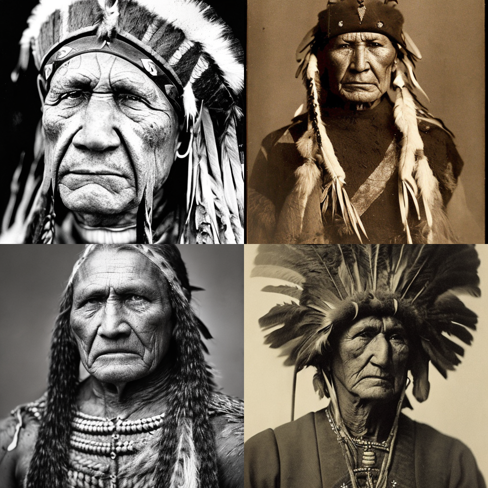

# MiniDiffusion

MiniDiffusion is a student project showcasing the creation, fine-tuning, and adaptation of diffusion models using PyTorch and the Diffusers library. It highlights three key approaches:  
1. **Using a Prebuilt Pipeline**: Generating images via an existing diffusion pipeline.  
2. **Manual Diffusion**: Implementing image generation without the pipeline, to gain a deeper understanding of the process.  
3. **LoRA Integration**: Fine-tuning the model using Low-Rank Adaptation (LoRA).

This project demonstrates modularity in image generation tasks, facilitating experimentation with various techniques and configurations.

## Table of Contents
1. [Setup Instructions](#setup-instructions)
2. [Project Structure](#project-structure)
3. [Key Features](#key-features)
4. [Results](#results)
5. [License](#license)

## Setup Instructions

### 1. Clone the Repository

```bash
git clone https://github.com/NightFore/MiniDiffusion.git
cd MiniDiffusion
```

### 2. Install Dependencies

```bash
pip install -r requirements.txt
```

### 3. Fine-tune the Model

Run the Jupyter notebook `MiniDiffusion.ipynb`.

```bash
jupyter notebook MiniDiffusion.ipynb
```

## Project Structure

```
MiniDiffusion/
│
├── MiniDiffusion.ipynb             # Jupyter notebook for experimentation
├── data/                           # Directory for storing data
│   ├── models/                     # Pre-trained models and checkpoints
│   ├── cache/                      # Cache for downloading models or other resources
│   └── loras/                      # LoRA models
├── output/                         # Directory for saving results
├── requirements.txt                # Project dependencies
```

## Key Features

1. **Diffusion Models**: Utilizes `DiffusionPipeline` for image generation with pretrained models like Stable Diffusion and Stable Diffusion XL. Supports batch generation and customizable prompts.

2. **Without a Pipeline**: Demonstrates manual image generation, building the diffusion process without the `DiffusionPipeline` for learning purpose.

3. **LoRA Integration**: Includes an example of integrating LoRA (Low-Rank Adaptation) to fine-tune diffusion models efficiently.

4. **PyTorch Setup**: Leverages PyTorch and CUDA for GPU-accelerated inference, optimized for memory usage.

5. **Customizable Image Generation**: Features flexible settings for prompts, batch size, and image grid output, with options for seed control.

6. **Model Management**: Manages model loading and caching, including support for local paths and Hugging Face Hub downloads.


## Results

### Image Generation Results

- **Model**: `stable-diffusion-v1-5/stable-diffusion-v1-5`  
- **Prompt**: Portrait photo of an old warrior chief  



### Comparison: Without LoRA vs. With LoRA

- **Model**: `Linaqruf/pastel-anime-xl-lora`  
- **LoRA**: `pastel-anime-xl.safetensors`
- **Prompt**: Face focus, cute, masterpiece, best quality, 1 girl, sweater, looking at viewer, upper body, beanie, outdoors, night, turtleneck  

#### Without LoRA  


#### With LoRA  


## License

This project is licensed under the MIT License - see the [LICENSE](LICENSE) file for details.
